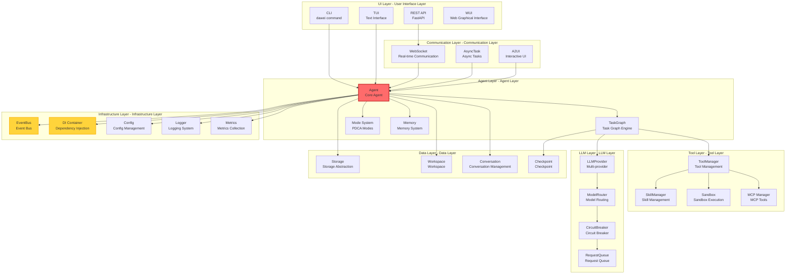

[English](README.md) | [中文](README_CN.md) | 

# Dawei AI Personal Assistant

## Core Principles

- Human-centric, user-friendly
- Learn, practice, refine, and improve through iteration

## Features

- Visual UI: Installation and editing of agents and agent teams
- Open and integrated agent and skills marketplace (http://www.davybot.com/market/skills), one-click install and uninstall. For skills reference, see [docs/user/skills/work-with-skills.md](docs/user/skills/work-with-skills.md)
- Data Security: No file uploads, privacy protection
- Cross-platform, easy to install
  - pip version: Install davybot via pip, access webui via browser on local or other machines; especially suitable for Linux systems without GUI
  - standalone version: Download zip package, extract and run, no additional installation required
- Minimal dependencies, complete agent system building
- Scheduled and periodic task system
- Instant messaging (Feishu, etc.) plugin system

## Key Metrics

- **Lines of Code**: 100,000+ lines
- **Message Types**: 61 WebSocket message types
- **Custom Tools**: 60 tool classes
- **Modes**: 5 PDCA modes (orchestrator, plan, do, check, act)
- **Plugin Types**: 2 base classes (ToolPlugin, ServicePlugin)
- **Supported Languages**: 3 languages (en, zh_CN, zh_TW)

## Typical User Commands

- Please use @skill1 to extract key content from @xx.pdf and save as xx.ppt
- Please use @ppt skill to optimize @xx.ppt

# Quick Installation

## pip

```bash
# Install
pip install davybot
# or
pip install -i https://pypi.org/simple/ davybot

# Start
dawei server start
# or
python -m dawei.cli.dawei server start
# Ctrl + C to exit

# Access
http://localhost:8465/app

```

# Web UI


[Web UI Details](asserts/web-ui/README.md)

# Coming Soon

## combot: Computer Bot

Developing plugins for Feishu, WeChat, and other platforms to implement agent control features through instant messaging tools, similar to openclaw.

# Tech Stack
| Component | Version | Description |
|-----------|---------|-------------|
| **Tauri** | 2.x | Rust frontend framework |
| **Rust** | stable | via dtolnay/rust-toolchain |
| **Node.js** | 22 | Frontend build |
| **pnpm** | 9 | Package manager |
| **Python** | 3.12 | Backend runtime (embedded) |
| **UV** | 0.10.6 | Python package manager (embedded) |

# Platform Support
## ✅ Supported Platforms

| Platform | Architecture | Build Status | Package Format | Notes |
|----------|--------------|---------------|----------------|-------|
| **Linux** | x86_64 | ✅ Full Support | ZIP | Verified, 135M |
| **macOS** | x86_64 | ✅ CI Support | ZIP | Intel Macs |
| **macOS** | aarch64 | ✅ CI Support | ZIP | Apple Silicon |
| **Windows** | x86_64 | ✅ CI Support | ZIP | Local build unverified |

### 📈 Support Coverage

- **Desktop Platforms**: 100% (Linux, macOS, Windows full coverage)
- **Architecture Support**: 90% (x86_64 all platforms, ARM64 Linux/macOS support)
- **CI/CD**: 100% (All platforms have GitHub Actions workflow)

# System Architecture



# Dependency Repositories

## Market and Resources
- https://github.com/geluzhiwei1/davybot-market-cli
- https://github.com/geluzhiwei1/davybot-skills
- https://github.com/geluzhiwei1/davybot-agents

## Plugins - Instant Messaging Tools

- https://github.com/geluzhiwei1/davybot-plugins-im.git

# User Help

## Documentation
 - Plugin Installation and Setup [docs/user/instant-message/feishu.md](docs/user/instant-message/feishu.md)

## Videos
- Installation and Configuration: https://www.bilibili.com/video/BV1XDZfBvEit?t=7.0
- Installation and Usage of Skills: https://www.bilibili.com/video/BV1whZfBJEde?t=122.5

# WeChat Group Chat

