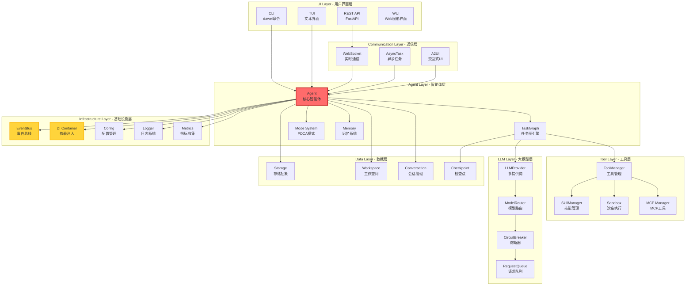

[English](README.md) | [中文](README_CN.md) | 

# 大微-AI个人助手

## 核心原则

- 以人为本，用户友好
- 知、行、修、齐，迭代提升

## 特性

- 可视化UI：智能体、智能体团队的安装和编辑
- 开放、集成的智能体、技能市场(http://www.davybot.com/market/skills)，一键安装和卸载。skills参考[docs/user/skills/work-with-skills.md](docs/user/skills/work-with-skills.md)
- 数据安全：文件不上传，隐私保护
- 跨平台、易安装
 - pip版本： 通过pip安装davybot，在本机或其他机器使用浏览器访问webui；特别适用于无GUI的Linux系统
 - standalone独立版： 下载zip包，解压就可以运行，无须额外安装
- 极简依赖，完整构建智能体系统
- 定时、周期任务系统

## 关键指标统计

- **代码行数**: 103,012 行
- **消息类型**: 61 种 WebSocket 消息类型
- **自定义工具**: 60 个工具类
- **模式数**: 5 个 PDCA 模式 (orchestrator, plan, do, check, act)
- **插件类型**: 2 个基类 (ToolPlugin, ServicePlugin)
- **支持语言**: 3 种 (en, zh_CN, zh_TW)

## 视频
- 安装和配置：https://www.bilibili.com/video/BV1XDZfBvEit?t=7.0
- 安装和使用skill: https://www.bilibili.com/video/BV1whZfBJEde?t=122.5

## 典型用户指令

- 请你使用@skill1技能，提取@xx.pdf的重点内容，保存为xx.ppt
- 请你使用@ppt技能，优化@xx.ppt

# 快速安装

## pip

``` bash
# 安装
pip install davybot
# 或者
pip install -i https://pypi.org/simple/ davybot

# 启动
dawei server start
# 或者 
python -m dawei.cli.dawei server start
# Ctrl + C 退出

# 访问
http://localhost:8465/app

```

# Web UI


[Web UI 详情](asserts/web-ui/README.md)

# Next 即将发布

## combot: Computer Bot

开发飞书、微信等插件，实现类似openclaw的通过即时聊天工具控制agent的功能。

# 技术栈
| 组件 | 版本 | 说明 |
|------|------|------|
| **Tauri** | 2.x | Rust 前端框架 |
| **Rust** | stable | 通过 dtolnay/rust-toolchain |
| **Node.js** | 22 | 前端构建 |
| **pnpm** | 9 | 包管理器 |
| **Python** | 3.12 | 后端运行时 (内嵌) |
| **UV** | 0.10.6 | Python 包管理器 (内嵌) |

# 平台支持
## ✅ 已支持平台

| 平台 | 架构 | 构建状态 | 打包格式 | 备注 |
|------|------|----------|----------|------|
| **Linux** | x86_64 | ✅ 完整支持 | ZIP | 已验证，135M |
| **Linux** | aarch64 | ✅ CI支持 | ZIP | ARM64交叉编译 |
| **macOS** | x86_64 | ✅ CI支持 | ZIP | Intel Macs |
| **macOS** | aarch64 | ✅ CI支持 | ZIP | Apple Silicon |
| **macOS** | Universal | ✅ CI支持 | ZIP | Intel + ARM (lipo合并) |
| **Windows** | x86_64 | ⚠️ 配置存在 | ZIP/NSIS | 本地构建未验证 |

### 📈 支持覆盖率

- **桌面平台**: 100% (Linux, macOS, Windows 全覆盖)
- **架构支持**: 90% (x86_64全平台, ARM64 Linux/macOS支持)
- **CI/CD**: 100% (所有平台均有 GitHub Actions workflow)


# 系统架构



# 发布计划
- [√] 开发者预览版本（多平台）： 给有开发经验的专业技术人员试用，需要clone 代码，自行安装运行, 参见 [docs/development/local-development.md](docs/development/local-development.md)
- [√] 技术人版本（多平台）： 给技术人或者有一定计算机基础的人员试用，使用pip install 安装
- windows app版本： windows 下载安装，直接使用
- Linux app 版本： Ubuntu 下载安装，直接使用
- 移动端 App 版本（跨平台）： 手机版本，安装后直接使用 

# 依赖代码库

## 集市和资源
- https://github.com/geluzhiwei1/davybot-market-cli
- https://github.com/geluzhiwei1/davybot-skills
- https://github.com/geluzhiwei1/davybot-agents

## 插件-即时聊天工具

- https://github.com/geluzhiwei1/davybot-plugins-im.git


# 微信交流群

