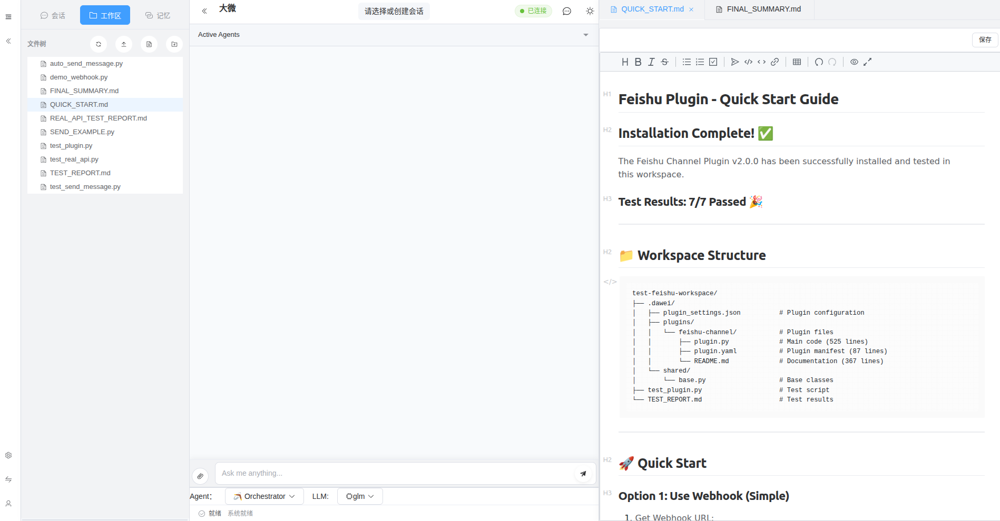

# Dawei AI Personal Assistant

# Web UI

[Web UI Details](asserts/web-ui/README.md)

# Coming Soon

## combot: Computer Bot

Developing plugins for Feishu, WeChat, and other platforms to implement agent control features through instant messaging tools, similar to openclaw.

# Release Plan
- [√] Developer Preview (Multi-platform): For experienced professional developers. Requires cloning code and self-installation. See [docs/development/local-development.md](docs/development/local-development.md)
- [√] Tech Version (Multi-platform): For tech-savvy users or those with some computer background. Install via pip install
- Windows App Version: Download and install on Windows for direct use
- Linux App Version: Download and install on Ubuntu for direct use
- Mobile App Version (Cross-platform): Mobile version, install and use directly

# Dependency Repositories

## Market and Resources
- https://github.com/geluzhiwei1/davybot-market-cli
- https://github.com/geluzhiwei1/davybot-skills
- https://github.com/geluzhiwei1/davybot-agents

## Plugins - Instant Messaging Tools

- https://github.com/geluzhiwei1/davybot-plugins-im.git

# WeChat Group Chat

