# Dawei 架构图文档

## 1. 系统架构图（分层架构）

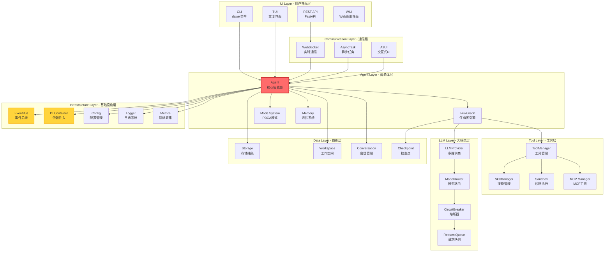

## 2. 3C 图（Component - Class - Connection）

### 2.1 核心 3C 图

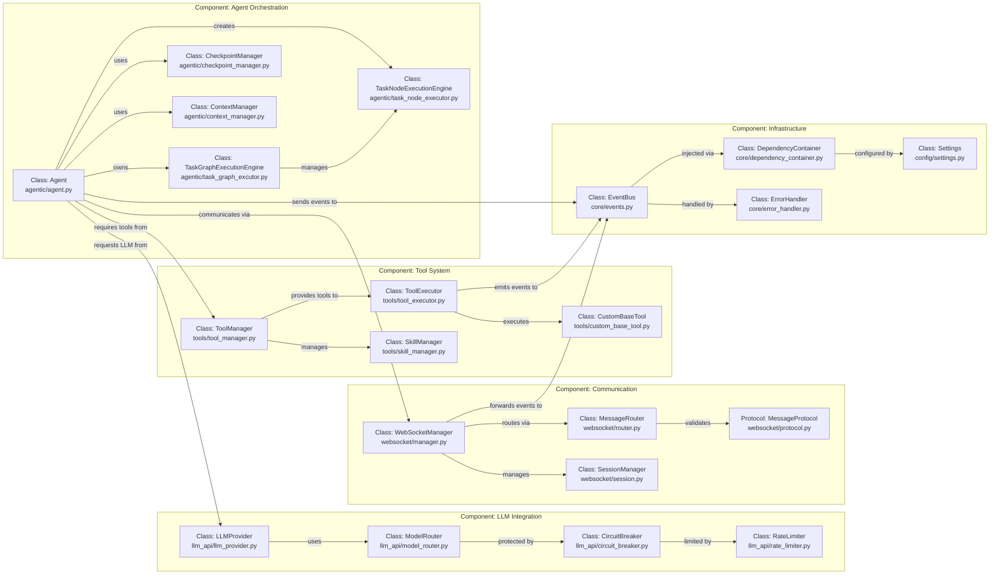

### 2.2 详细类关系图

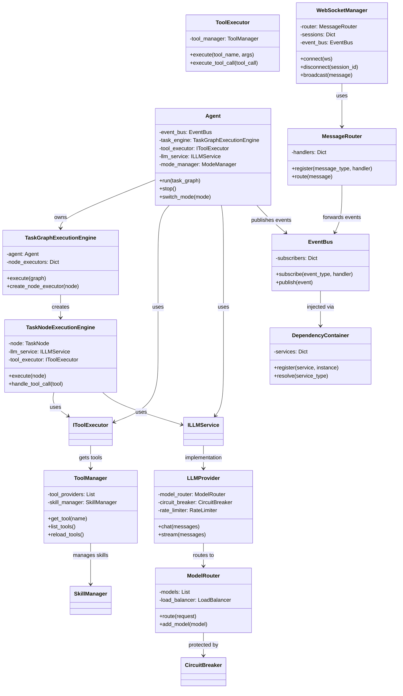

## 3. 模块依赖关系图

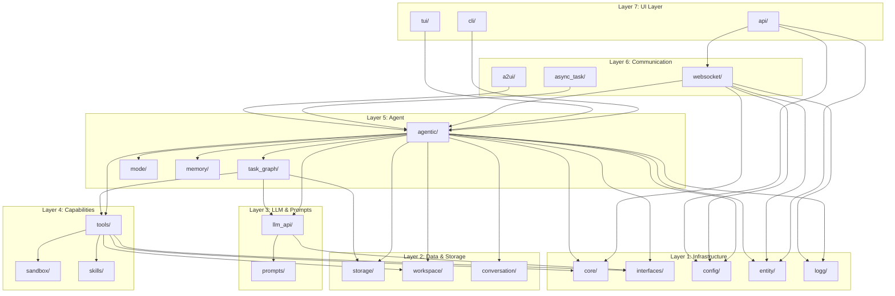

## 4. 核心流程图

### 4.1 Agent 执行流程

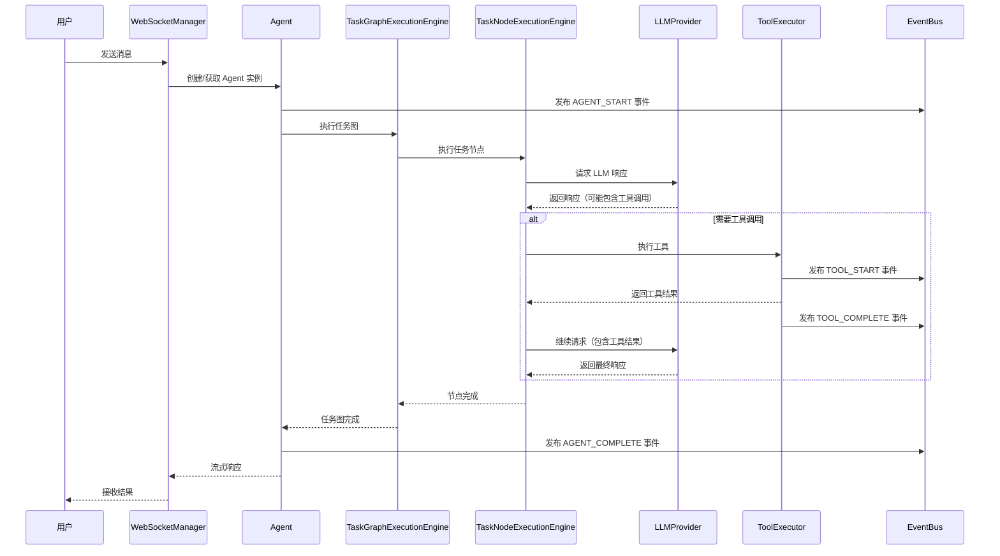

### 4.2 WebSocket 消息流

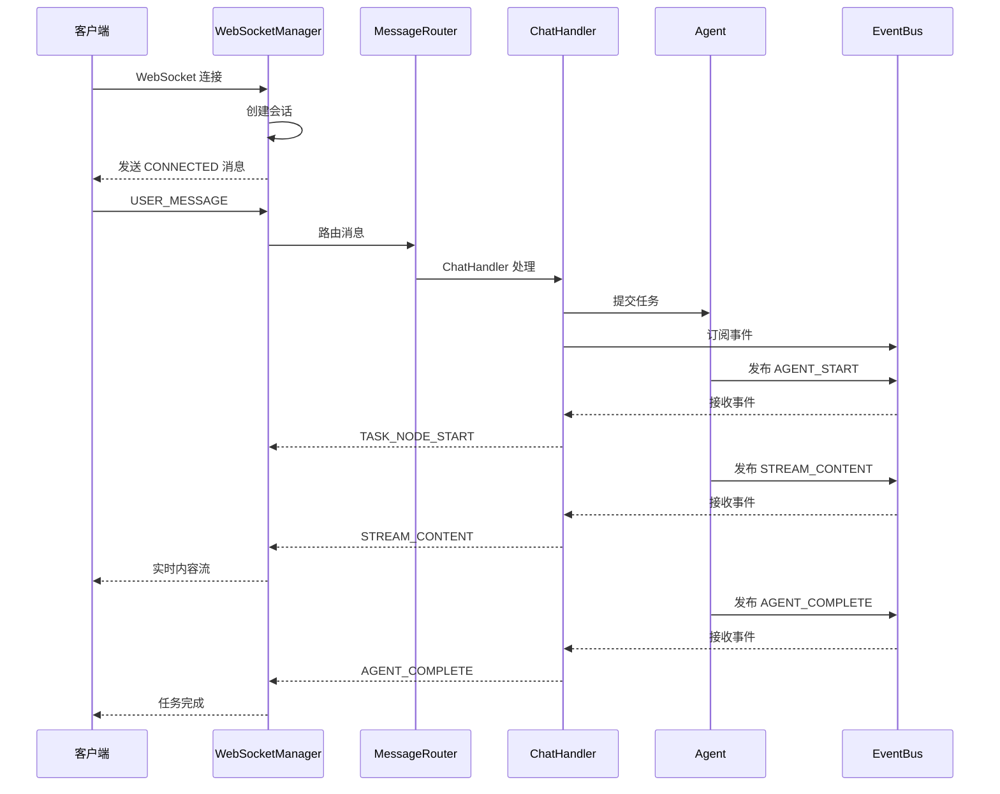

### 4.3 工具发现和执行流程

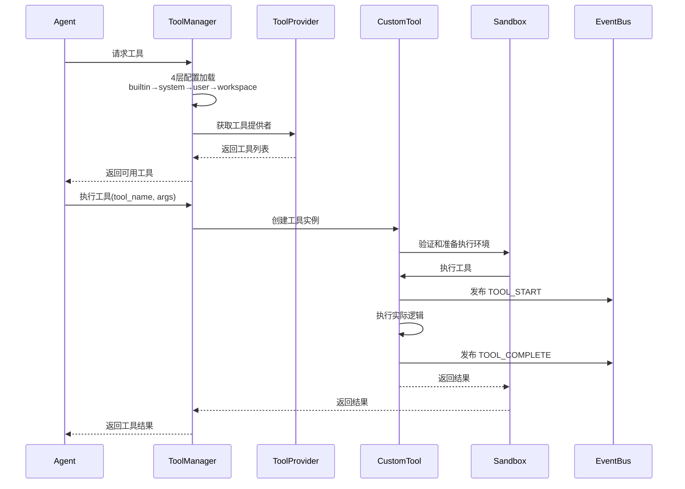

## 5. 模式系统（PDCA）图

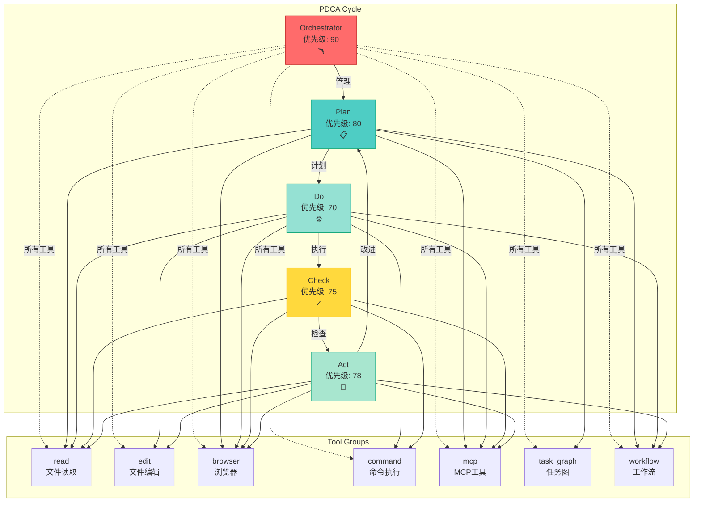

## 6. 数据流图

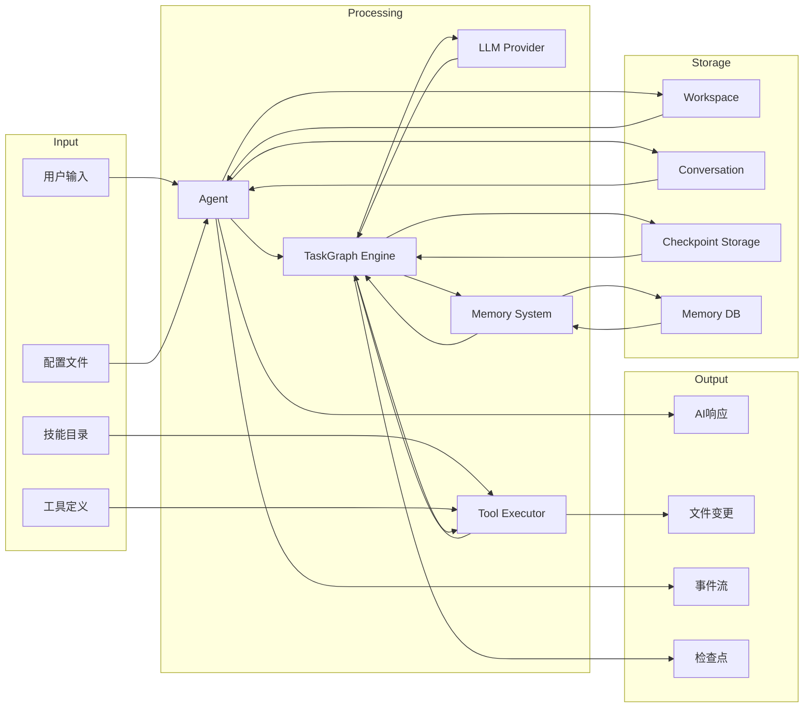

## 7. 配置加载层级图

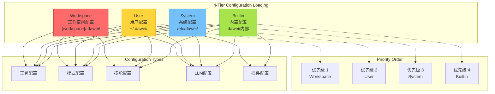

## 8. 事件驱动架构图

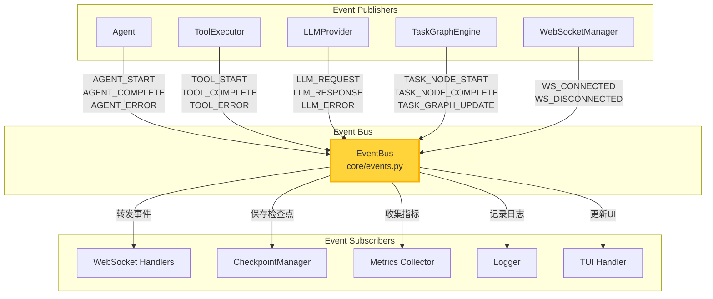

## 9. 插件系统架构图

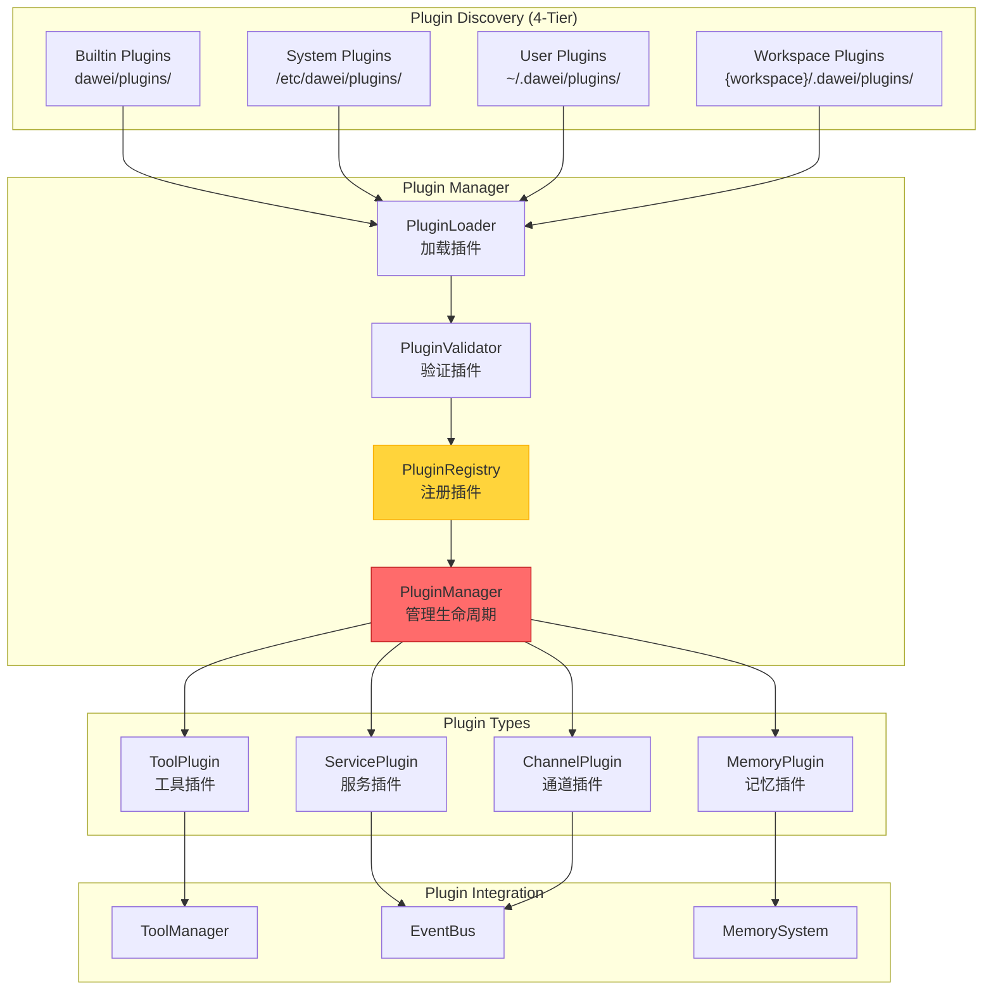

## 10. 记忆系统架构图

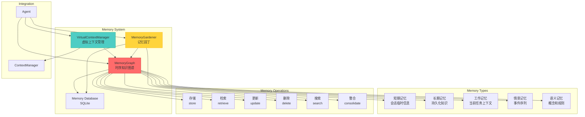

## 11. 技能系统架构图

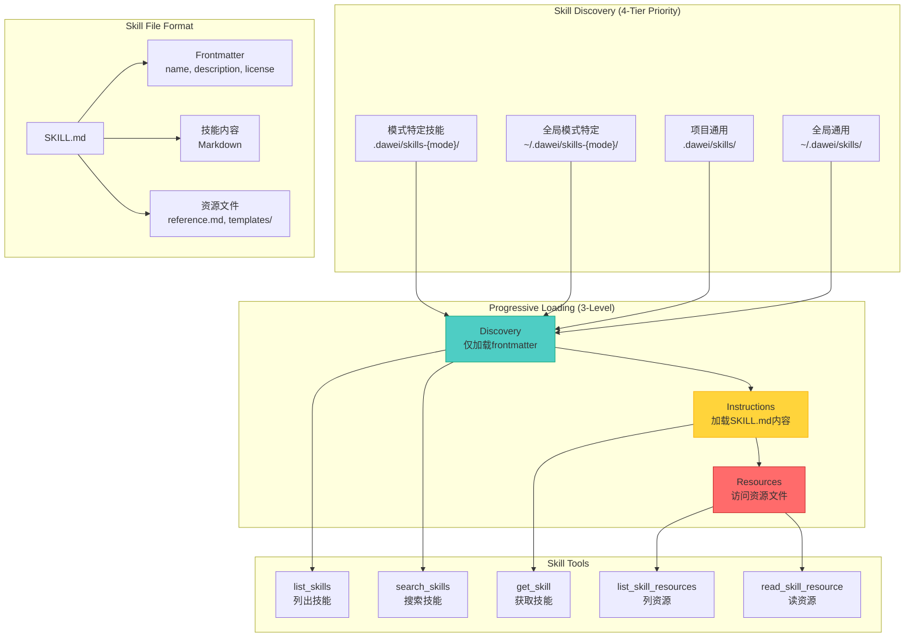

## 12. 关键指标统计

- **总文件数**: 98 个 Python 文件
- **主模块数**: 24 个模块
- **代码行数**: 103,012 行
- **消息类型**: 61 种 WebSocket 消息类型
- **自定义工具**: 60 个工具类
- **模式数**: 5 个 PDCA 模式 (orchestrator, plan, do, check, act)
- **工具组**: 8 个组 (read, edit, browser, command, mcp, modes, task_graph, workflow)
- **插件类型**: 2 个基类 (ToolPlugin, ServicePlugin)
- **支持语言**: 3 种 (en, zh_CN, zh_TW)

## 13. 核心设计原则

1. **KISS (Keep It Simple, Stupid)** - 简化的实现
2. **DRY (Don't Repeat Yourself)** - 代码复用
3. **Fast Fail** - 快速失败原则
4. **Interface Segregation** - 接口隔离
5. **Single Responsibility** - 单一职责
6. **Open/Closed** - 开闭原则
7. **Dependency Inversion** - 依赖倒置

## 14. 架构模式

- **分层架构** - 清晰的关注点分离
- **事件驱动架构** - EventBus 实现松耦合
- **依赖注入** - DependencyContainer 管理服务
- **仓储模式** - 存储抽象层
- **策略模式** - 多 LLM 提供商、工具执行器
- **观察者模式** - EventBus 订阅者
- **工厂模式** - 工具工厂、客户端工厂
- **建造者模式** - A2UI 建造器、提示构建器
- **模板方法** - 基础处理器、基础工具
- **适配器模式** - 存储适配器、LLM 适配器
